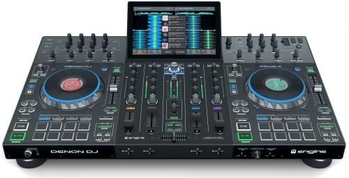
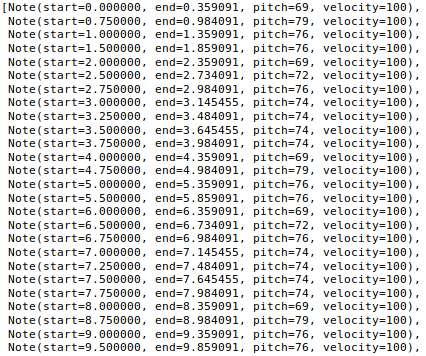
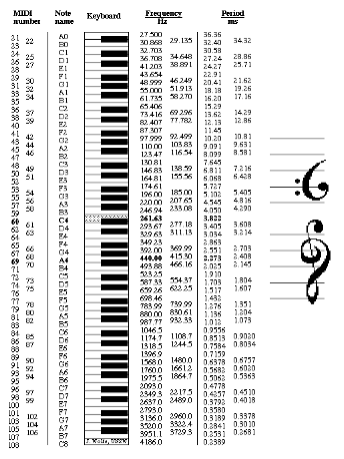
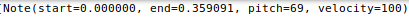
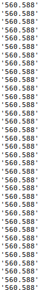

 # Generate EDM Melodies Using Recurrent Neural Networks

 ## Background  

 Despite lots of time and effort, my attempts at making dance music have been decidedly unsuccesful. Perhaps a computer can do a better job for me! 

 ## Data
Music is encoded in a number of different ways. For this project I chose to use Musical Instrument Digital Interface (MIDI) files. From Wikipedia, the definition of MIDI is: 

    "MIDI is a technical standard that describes a communications protocol, digital interface, and electrical connectors that connect a wide variety of electronic musical instruments, computers, and related audio devices for playing, editing and recording music.[1] A single MIDI link through a MIDI cable can carry up to sixteen channels of information, each of which can be routed to a separate device or instrument. This could be sixteen different digital instruments, for example. 

 I gathered EDM MIDI's from <a href="https://www.nonstop2k.com/"> nonstop2k </a>, <a href=https://www.cprato.com/> Carlos's MIDI </a>, and <a href=https://bitmidi.com/> bitmidi</a>. In total I collected 71 MIDIs from artists including Marshmellow, Alesso, Avicii, Tiesto, Kygo, and more.

 ## Pre-processing

 I chose to use the pretty_midi library within python to pre-process MIDI's. Below is an image of a pretty_midi object and how it interprets a MIDI file:

 

 As you can see, a MIDI basically has four components: Note on, Note off, pitch, and velocity. Pitch is the number of the note played and velocity is the force with which the note is played (the name is derived from how fast a piano key is pressed). Below is a visual representation of how MIDI corresponds to notes:

 

 My original intent was to generate entire songs. I soon realized I was doomed when nearly every I researched on medium and towardsdatascience focused on classical piano music. This is for good reason, generating music with multiple instruments is difficult. Basically, it would involve training a model to produce melodies. and then training another model to accompany that model. One possible approach to this is generating audio with other raw audio, such as <a href=https://deepmind.com/blog/article/wavenet-generative-model-raw-audio> WaveNet </a>. This means I had to extract the melodies from my MIDI's. This, predictably, resulted in significant loss. Melodies in multi-instrument songs interact with the accompaniments. When you remove them, it fundamentally changes the melody. To attempt to mitigate this, I removed long rests that existed in the melodies alone. Below is an example of Tiesto and John Christian's "Can You Feel It" before and after processing:

 ### Before:

 

 ### After:

 

 Following melody exactraction and reduction, it was time to featurize the data. My original intent was to one-hot encode every single event (Note on, Note off, pitch, velocity) in a MIDI as proposed by Oore et al. in <a href=https://arxiv.org/pdf/1808.03715.pdf> This Time with Feeling </a>. However, due to time constraints, I was forced to take a different approach. I decided to represent every note object in a pretty_midi object as a single encoded psuedo-note consisiting of duration (end), velocity, and pitch. Below is an example of how a note looked in pretty_midi format and how I encoded it:

  
 
 690.359100

 Now it was time to prepare the input for the model. Of the 13,239 total notes in my corpus, there are 855 unique psuedo-notes. I then created a dictionary of unique note to integer,and then normalized the values. 

 ## Model

 I chose to use a Long-Short-Term Memory (LSTM) network. Accoring to <a href=https://en.wikipedia.org/wiki/Long_short-term_memoryWikipedia> Wikipedia </a>: 
    
    LSTM networks are well-suited to classifying, processing and making predictions based on time series data, since there can be lags of unknown duration between important events in a time series.

I used a design put forth by Sigurour Skuli in <a href=https://towardsdatascience.com/how-to-generate-music-using-a-lstm-neural-network-in-keras-68786834d4c5> Generate Music using a LSTM Neural Network in Keras </a>. 

## Big Reveal

After training my model for 95 epochs on my local machine, which took approximately nine hours, the model predicted the following psuedo-note sequence:

Looks like a beautiful melody! Unfortunately, I've had some issues decoding the psuedo notes back into MIDI format. We'll have to imagine how it sounds for now. 

## Lessons Learned/Future

* Data selection when attempting to generate music with machine learning is important. 

* Melodies without their accompaniments are fundamentally changed. 

* Attempt different models (Transformer with Self-Attention?)

* Different ways to encode muisc (pure audio, one-hot encoding)

