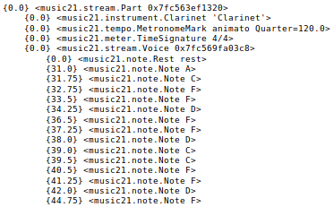
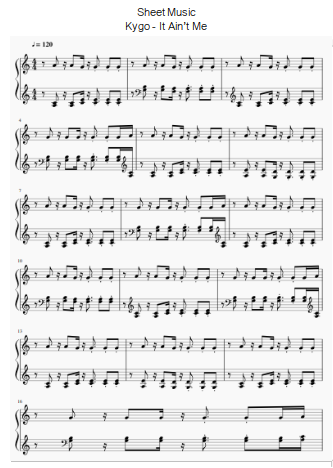
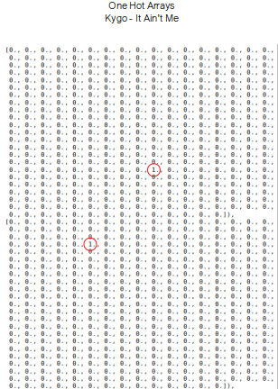
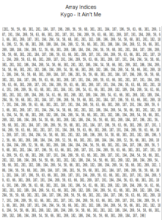
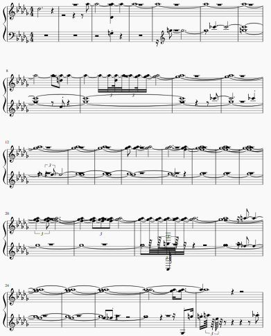
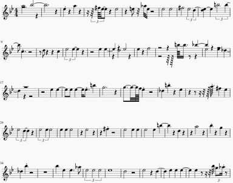

 # Generate Electronic Dance Music Melodies Using Recurrent Neural Networks

 ## Background  

 > “ The music is not in the notes, but in the silence between them.”\
 > &nbsp;&nbsp;&nbsp;&nbsp;&nbsp;&nbsp;&nbsp;&nbsp;&nbsp;&nbsp;&nbsp;&nbsp;&nbsp;&nbsp;&nbsp;&nbsp;&nbsp;&nbsp;&nbsp;&nbsp;&nbsp;&nbsp;&nbsp;&nbsp;&nbsp;&nbsp;&nbsp;&nbsp;&nbsp;&nbsp;&nbsp;&nbsp;&nbsp;&nbsp;&nbsp;&nbsp;&nbsp;&nbsp;&nbsp;&nbsp;&nbsp;&nbsp;&nbsp;&nbsp;&nbsp;&nbsp;&nbsp;&nbsp;&nbsp;&nbsp;&nbsp;&nbsp;&nbsp;&nbsp;&nbsp;&nbsp;&nbsp;&nbsp;&nbsp;&nbsp;&nbsp;&nbsp;&nbsp;&nbsp;&nbsp;&nbsp;&nbsp;&nbsp;&nbsp;&nbsp;&nbsp;&nbsp;&nbsp;&nbsp;&nbsp;&nbsp;&nbsp;&nbsp;&mdash; Claude Debussy

Can deep learning models be to capture the emotion and expressiveness in music? As Debussy indicates, music is more than a simple sequence of notes. It is a combination of timing, dynamics, and sound. This presents a unique challenge, is it possible to train a recurrent neural network to predict more than the next note in a sequence, but also note duration, rests, and varying volumes. 

 ## Data
Music is encoded in a number of different ways. For this project I chose to use Musical Instrument Digital Interface (MIDI) files. From Wikipedia, the definition of MIDI is: 

"MIDI is a technical standard that describes a communications protocol, digital interface, and electrical connectors that connect a wide variety of electronic musical instruments, computers, and related audio devices for playing, editing and recording music.[1] A single MIDI link through a MIDI cable can carry up to sixteen channels of information, each of which can be routed to a separate device or instrument. This could be sixteen different digital instruments, for example. 

 I gathered EDM MIDI's from <a href="https://www.nonstop2k.com/"> nonstop2k </a>, <a href=https://www.cprato.com/> Carlos's MIDI </a>, and <a href=https://bitmidi.com/> bitmidi</a>. In total I collected 73 MIDIs from a variety of artists. A few of my favorite tracks are:
    
  
    Avicii - Heart Upon My Sleeve\
    Mako - Smoke Filled Room\
    Marhshmello featuring Bastille -Happier\
    Tritonal - Anchor

  

 ## Pre-processing

 I chose to use music21, a library developed by MIT, to pre-process MIDI's. Below is an image of how music21 represents a MIDI file:

 

MIDI notes have four components: Note on, Note off, pitch, and velocity. Pitch is the MIDI number of the note played and velocity is the force with which the note is played (the name is derived from how fast a piano key is pressed). Below is a visual representation of how MIDI numbers corresponds to notes:

 

 My original intent was to generate entire songs, though I soon realized I was doomed. Generating music with a single instruments is difficult, and the jump to multiple instruments is large. Thus, for this project, I decided to focus only on melodies. If the instrument that played the melody in the song wasn't obviously labeled in the MIDI (called lead or melody, for example), I had to determine by listening. I then extracted the melodies, and created new MIDI's. 

### One Hot Encoding

To featurize the data, I decided to use an approach put forth by Oore et al. in <a href=https://arxiv.org/pdf/1808.03715.pdf> This Time with Feeling </a>. Every "event" in a song was represented as a one hot encoded array of length 388. Indices 0-127 represent notes turning on and 128 - 255 are notes turning off (there are 128 possible notes in a MIDI). Indices 256-355 are time shifts in ten millisecond steps. The maximum encodable time step in one array is one second If a note or a rest is longer than one second, it is encoded as one second, then the remainder is encoded in the next array. Indices 356-387 are for volume. There are 128 possible volumes in a MIDI, these are binned into the 32 indices. Below is a visual representation of Kygo's "It Ain'e Me" in sheet music form, then showing the first two arrays of the song after encoding, and finally, a list of all the indices where each array is one hot encoded in the song. 

  

 ## Model

 I chose to use a Long-Short-Term Memory (LSTM) network. Accoring to <a href=https://en.wikipedia.org/wiki/Long_short-term_memoryWikipedia> Wikipedia </a>: 
    
"LSTM networks are well-suited to classifying, processing and making predictions based on time series data, since there can be lags of unknown duration between important events in a time series."

I used a design put forth by Sigurour Skuli in <a href=https://towardsdatascience.com/how-to-generate-music-using-a-lstm-neural-network-in-keras-68786834d4c5> Generate Music using a LSTM Neural Network in Keras </a>. Below is the architecture of the model:
- Two Bidirectional 512 node LSTM layers
- Dropout layer with a rate of 0.3
- Softmax activation function
- Predicts the next event from the previous 50

## Song Generation

After the model was trained, it was time to make some music! To generate the first event, the model was fed 50 random events that existed in the corpus. Then, it added that event to the end of the 50 random events, and used it, along with the previous 49, to create a new event. This continued for the length of the song, then the original 50 were discarded. 

## Results

### Sheet Music after 15 epochs:          

### Sheet Music after 100 epochs:

I generated a variety of more songs after different training epochs. Here is a link to my soundcloud that includes all the songs: <a href=https://soundcloud.com/bacon-kawasaki/> soundcloud </a>

## Discussion
After epoch 15, the model had some
strange results. It generated multiple
notes that last nearly the entire length of
the song. The model after epoch 100
created a wider range of notes and for
more realistic duration. In addition, it
played those notes with varying
velocities, though this is not visible in the
sheet music. Interestingly, after 200
training epochs, the model generated
significantly more rests than the
previous versions. This could be
because it was trained on only the
melodies from songs with multiple
instruments. Even after removing long
rests, the songs still had lots of shorter
rests that were occupied by
accompaniments in the full songs. 

## Future Work
Currently, this method is only
applicable to a single instrument. Indeed,
during my research, nearly every
approach focused on a single instrument.
I believe it is possible to expand the
mechanism of one hot encoding every
event in a song to include every
instrument in the piece. This way, a deep
learning model may be able to generate
an entire song!

